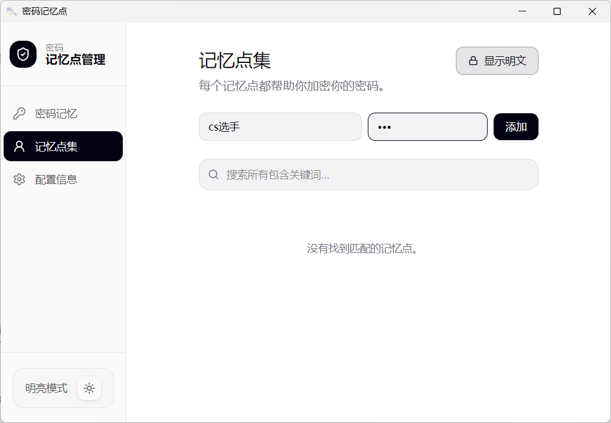
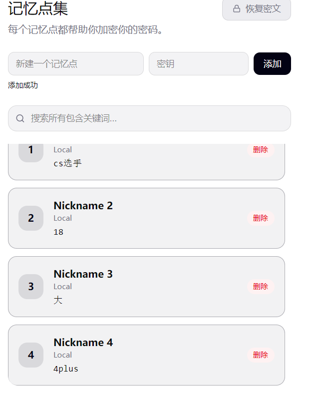
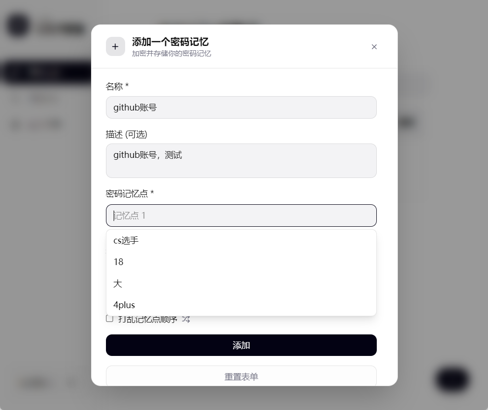
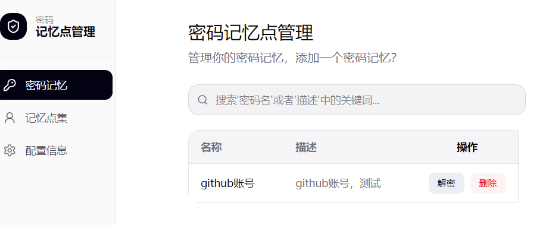
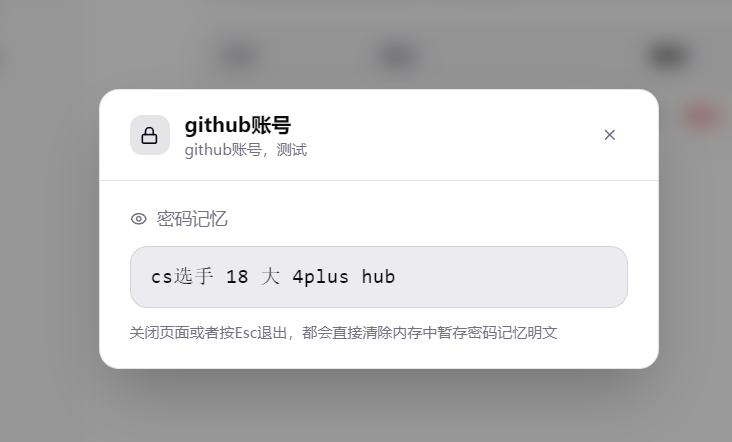
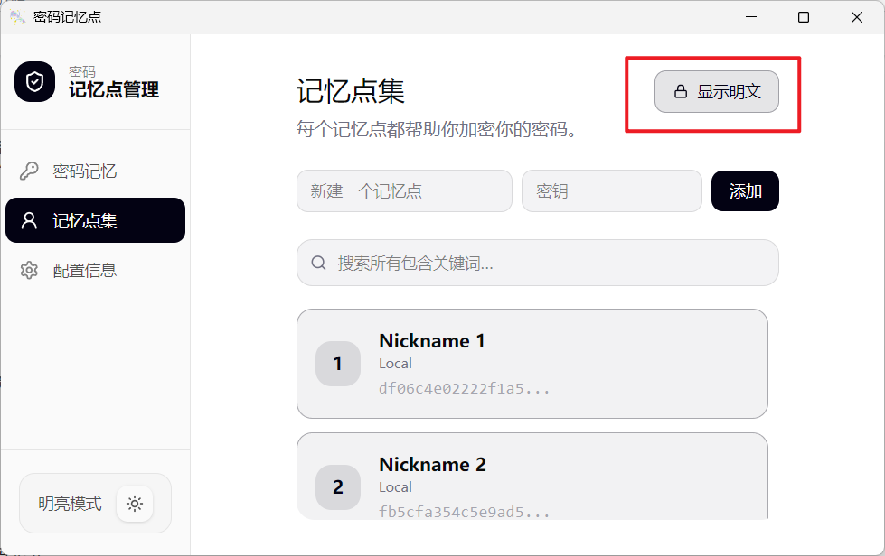
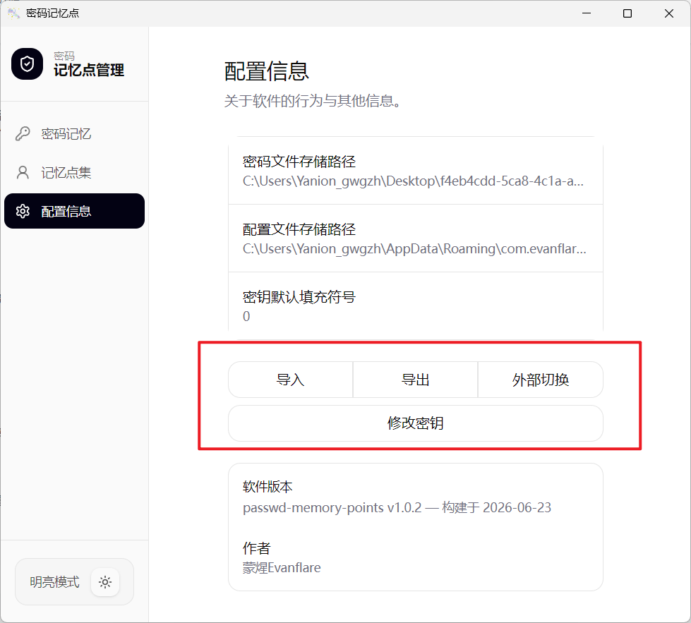
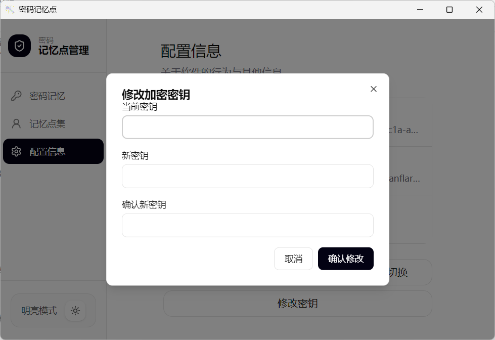

# 密码记忆点管理

密码记忆点管理：不直接存储密码，而是存储组成密码记忆的密码点。通过每个人独特的意向记忆来生成、存储、查询密码记忆。

可通过已存在的意向记忆点生成随机密钥，让每个平台的密码都不相同。
采用强加密算法加密记忆点以及密码记忆，加之密码记忆不直接存储密码使得存储的信息几乎不能被用于破解密码。

## 下载安装

支持Windows与Android平台，安装包发布在 [github release页](https://github.com/Evanflare/passwd-memory-points/releases)
或者 gitee 同名仓库的release页中。[前往下载](https://gitee.com/Evanflare/passwd_memory_points/releases)

## 特点

为什么要使用密码记忆点管理我们的密码？

1. 不直接存储密码
2. 快速查询并回忆密码
3. 快速密码随机生成并避免重复
4. 安全备份可随意导入导出
5. 一键更换加密密钥
6. windows+android双端管理
7. 本地存储无联网功能

## 快速开始

### 1. 我们需要将一个密码转换成密码记忆，从密码记忆中提取出密码记忆点。

例如：
这里有一个github账号的密码:
`s1mple12345678Hub*`

转换成密码记忆：
我最喜欢的cs选手id 1到8 # 大写 hub

> 密码记忆就是我们对密码的记忆理解

### 2. 将密码记忆映射拆分成记忆点

接上个例子：
有一个密码记忆：
我最喜欢的cs选手id 1到8 # 大写 hub 

转换成独特密码记忆点：
cs选手 18 4plus 大 hub 

  - cs选手 ：S1mple
  - 18 ： 12345678
  - 4plus ：#
  - 大 ：后面的第一个字母大写
  - hub ：hub

### 3. 将密码记忆点加密存储

将密码记忆点与真实密码的映射关系用物理介质记录下来，防止后期忘记记忆点的含义。
将记忆点添加到软件中并设计简单的加密密码例如：123

添加成功后会自动加密保存。

### 4. 添加密码记忆

添加后的记忆点在添加密码记忆的页面可选，或者自行输入字符串。

### 5. 查询与修改

点击解密输入正确密钥后会显示密码记忆

对于记忆点也需要进行解密才能查看到明文

### 6. 导入导出

支持导入导出密文文件，方便进行备份和同步

### 7. 修改加密密钥

提供修改加密密钥功能，可快速更改加密密钥

